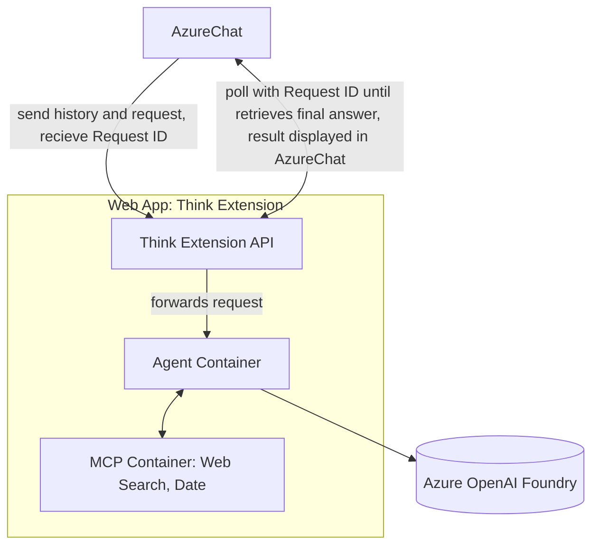

# think-extension-azure-chat  
Thinking extension service for [AzureChat](https://github.com/microsoft/azurechat)  

This repository presents the **Think Extension**, a service developed to enhance AzureChat by enabling asynchronous processing for complex, long-running AI tasks. Instead of modifying AzureChat itself, the Think Extension leverages its function-calling mechanisms to execute tasks asynchronously and return results once complete.  

No time to read? This is audio [deep dive](extras/docs/think-estension.mp3) 

---

## 📖 Overview: Extending AzureChat’s Capabilities  
[AzureChat](https://github.com/microsoft/azurechat) is an accelerator for building enterprise AI applications, making it possible to deploy a fully functional corporate chatbot in under an hour. It provides enterprise-grade security, authentication, secret management, built-in user roles, Retrieval-Augmented Generation (RAG), accessibility features, and seamless tool integration.  

While AzureChat is powerful, it primarily supports **synchronous chat**. Many enterprise AI tasks—such as deep research—require **long-running, asynchronous operations**, which this Think Extension provides.  

---

## ⚙️ How the Think Extension Works  

The Think Extension operates as an **external service**, integrating with AzureChat via external function calls.  

1. **Asynchronous Request Handling**  
   - AzureChat forwards a complex query to the Think Extension.  
   - The Think Extension returns an immediate ID (`HTTP 202 Accepted`) acknowledging the request.  
   - AzureChat polls the service with the ID until the result is ready.  

2. **Service Structure**  
   - **API Container**: Handles incoming requests, returns IDs, forwards work to the Agent.  
   - **Agent Container**: Core intelligence. Interacts with Azure OpenAI Foundry and tools.  
   - **Tool Containers**: MCP servers for specific tasks (e.g., web search, document retrieval).  

3. **Agent–Tool Interaction**  
   - The Agent requests tools as needed, integrates their outputs, and feeds results back to the LLM.  
   - The LLM composes a final response.  

4. **Final Response Delivery**  
   - The complete answer is stored in the API container.  
   - AzureChat retrieves it by polling with the original ID.  

This separation keeps AzureChat clean while supporting scalability (e.g., multiple agents, external databases like Cosmos DB).  

---

## 🔍 LLM Behavior Observations  
- **GPT-4**: Reliably shows when it uses a tool and bases answers on its output.  
- **GPT-5**: Sometimes skips tool usage but formats responses *as if* the tool was invoked. While answers may be correct, logs reveal the tool wasn’t actually called.  


### Known issues
#### 1. Inconsistent Tool Calling in GPT-5-chat

Several developers have reported that GPT‑5-chat occasionally behaves as you described—claiming to use a tool without actually doing so, or failing to initiate calls reliably.


This aligns with comments in Azure and OpenAI forums noting that GPT‑5‑chat isn’t a reasoning model and that support for tool usage is inconsistent. Some users have even had the model act like it's “thinking” or formatting a function call when no actual tool execution occurs.

- https://learn.microsoft.com/en-us/answers/questions/5517434/gpt-5-deployed-to-azure-ai-foundry-thinking-then-t?utm_source=chatgpt.com
- https://community.openai.com/t/gpt-5-breaks-the-agents-sdk-and-tool-calling/1341727?utm_source=chatgpt.com 

#### 2. Strict Function Schema Enforcement

GPT‑5 imposes stricter rules around schema validation for function/tool calls. Missing required parameters (even subtle ones like required in JSON schemas) can prevent tool invocation altogether, even though the model’s output may still indicate that a tool was used.

#### 3. You May Be Enabling “Minimal Reasoning Effort”

Azure AI Foundry’s GPT‑5 reasoning models allow you to adjust the reasoning_effort parameter. When set to minimal, parallel tool calling is explicitly disabled, meaning the model might skip invoking tools—even while suggesting it did.

---

## 💻 FastAPI Asynchronous Chatbot Interface  

This repo includes a **FastAPI app** implementing an asynchronous, polling-based chatbot interface with a mocked LLM.  

- Submits a new query → returns a request ID immediately (`HTTP 202 Accepted`).  
- Processes in the background.  
- Poll the same endpoint with the ID to retrieve the final result.  
- If the ID is invalid or expired, returns `404 {"detail": "Invalid or expired ID"}`.  

### Run Locally  

```bash
cd deploy
docker compose -f compose.local.yml up --build
```

API available at: [http://localhost:5000](http://localhost:5000), go to http://localhost:5000/docs to test api calls.

## AzureChat settings

- Name: external asynchronous think
- Short description: Extenstion which will be used to call external thinking service
- Description: You are expert in solving difficult questions, you are using external thinking service, you send chat history and user question and get the id back. Then you pull the thinking result using this id

Use this definition to send the user reqeust

```json
{
  "name": "RequestThink",
  "parameters": {
    "type": "object",
    "properties": {
      "body": {
        "type": "object",
        "description": "Submit a new query to be processed",
        "properties": {
          "history": {
            "type": "array",
            "description": "Conversation history (optional)",
            "items": {
              "type": "object",
              "properties": {
                "role": { "type": "string", "example": "user" },
                "message": { "type": "string", "example": "Hello" }
              }
            },
            "example": [
              { "role": "user", "message": "Hello" },
              { "role": "assistant", "message": "Hi, how can I help?" }
            ]
          },
          "user_query": {
            "type": "string",
            "description": "New user question to think about",
            "example": "What is SITHID?"
          }
        },
        "required": ["user_query"]
      }
    },
    "required": ["body"]
  },
  "description": "Submit a new 'think' task. Expect id of the task in return"
}
```


Use this definition to poll the results

```json
{
  "name": "PollThinkByID",
  "parameters": {
    "type": "object",
    "properties": {
      "body": {
        "type": "object",
        "description": "Poll for the result of a previously submitted think task",
        "properties": {
          "id": {
            "type": "string",
            "description": "Request ID returned by SubmitThink",
            "example": "1234567-e89b-12d3-a456-426614174000"
          }
        },
        "required": ["id"]
      }
    },
    "required": ["body"]
  },
  "description": "Submit a new 'think' task. Expect id of the task in return"
}
```

## Architecture

### Darkboard
This is an extension of the image from [azurechat](https://github.com/microsoft/azurechat/blob/main/docs/images/private-endpoints.png)


### Flowchart




# Credits
- MCP server design is inspired by https://github.com/alejandro-ao/mcp-streamable-http
- MCP client design is inspired by https://github.com/alejandro-ao/mcp-client-python-example
- AzureChat https://github.com/microsoft/azurechat